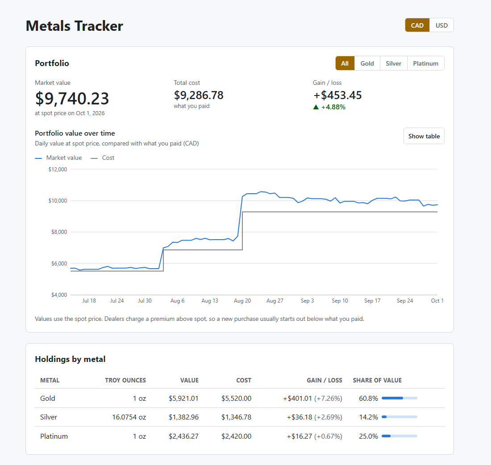
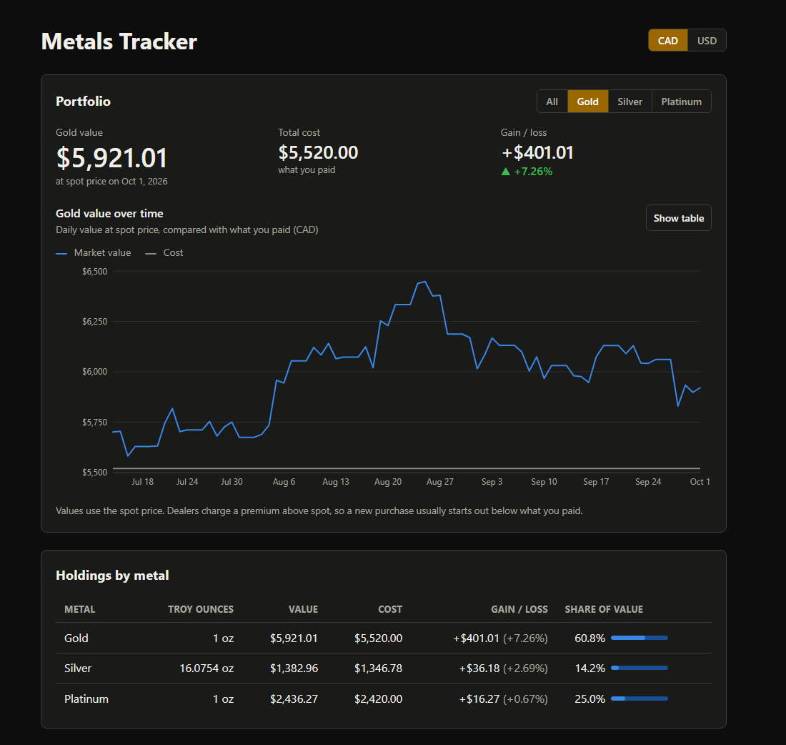
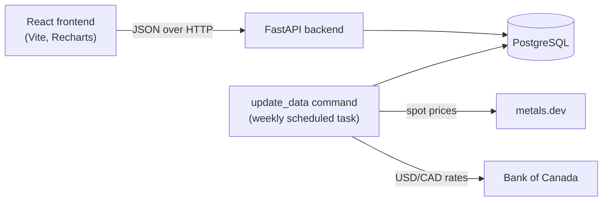

# Metals Tracker

[](https://github.com/Khalad-Osman/Metals-Tracker/actions/workflows/ci.yml)

A portfolio tracker for physical precious metals. Log purchases of gold, silver,
platinum and palladium, and see what your holdings are worth over time in Canadian
or US dollars, using daily spot prices and Bank of Canada exchange rates.

**[Live demo](https://metals-tracker.khaladosman213.workers.dev)**: try adding or editing a
purchase. It starts with sample purchases and real market prices, is shared by all
visitors, and resets every night. It runs on free hosting, so if nobody has visited for a
while, the first load can take up to a minute while the server starts.



<details>
<summary>Dark mode, filtered to gold</summary>



</details>

*Screenshots use demo purchases with real market data.*

## Features

- **Log purchases** in grams, troy ounces or kilograms, paid in CAD or USD. Weights are
  converted to troy ounces for calculations, and the original entry is kept for display.
- **Portfolio value over time**: a daily chart of market value against cost, with
  summary figures for value, cost and gain.
- **Filter by metal** to see one metal's performance on its own.
- **Holdings by metal**: weight, value, cost, gain and share of the portfolio.
- **CAD / USD toggle**: every figure is recalculated on the server in either currency.
- **Automatic daily data** from two APIs, updated by one command or a weekly scheduled task.
- **Dark mode** that follows the system setting.

## Tech stack

| Layer | Technology |
|---|---|
| Backend | Python 3.12, FastAPI, SQLModel, Alembic |
| Database | PostgreSQL 17 (Docker), with SQLite as a zero-setup fallback |
| Frontend | React 19, TypeScript, Vite, Recharts |
| Data | [metals.dev](https://metals.dev) (spot prices), [Bank of Canada Valet API](https://www.bankofcanada.ca/valet/docs) (USD/CAD) |
| Tooling | uv, npm, pytest, oxlint, GitHub Actions |
| Demo hosting | Cloudflare Workers (frontend), Render (API), Neon (PostgreSQL), all on free plans |

## Architecture



The public demo runs the same code in sandbox mode (`DEMO_MODE=sandbox`: anyone can change
purchases, within limits) with its own database. A scheduled GitHub Actions workflow
updates its market data and resets its purchases every night.

The backend stores three kinds of data: **purchases** (in their original currency and
unit), **daily spot prices** (USD per troy ounce, one row per metal per day), and
**daily exchange rates** (USD to CAD). Portfolio values are calculated on request from
these, rather than stored, so they're always consistent with the underlying data.

## Design decisions

**Money and weights use `Decimal`, never floats.** Floating-point numbers can't
represent amounts like 0.10 exactly, and the errors add up. The backend uses Python's
`Decimal` throughout, the database stores exact `NUMERIC` columns, and the API sends
amounts as strings (`"1903.65"`) so the browser never turns them into floats before
formatting them.

**Values are stored in their original currency and converted only for display.**
A purchase paid in USD stays in USD. When shown in CAD, its *cost* uses the exchange
rate on its purchase date, so the cost basis doesn't drift as rates change, while its
*market value* uses each day's rate. As a result, CAD and USD gains can legitimately
differ.

**Missing days are filled carefully.** Exchange rates aren't published on weekends or
Canadian holidays. Each day uses the most recent price or rate on or before it, but
only if it's at most 7 days old; otherwise the value is shown as unknown rather than
quietly using stale data.

**The price provider was chosen by testing, not by reading the docs.** The first
provider's documentation omitted three free-plan limits (one metal per request, at most
5 days per request, nothing older than 30 days), which were discovered against the real
API. That made backfilling purchase history impossible, so the fetcher was switched to
metals.dev, which returns all four metals for 30 days per request. The changes stayed
in the price-fetching code; the API, database, portfolio calculations and frontend
didn't change.

**Schema changes go through Alembic migrations**, and a test fails if a model changes
without a migration. Testing on PostgreSQL found that undoing a migration left enum
types behind, which only shows up on PostgreSQL; a test now undoes and redoes every
migration.

**Tests run against both SQLite and PostgreSQL.** The suite (128 tests) uses an
in-memory SQLite database by default, and runs against PostgreSQL when
`TEST_DATABASE_URL` is set. CI runs both. External APIs are replaced by fake HTTP
transports in tests, so tests never use real API quota.

**Accessibility.** Text colors meet WCAG contrast (at least 4.5:1) in light and dark
mode, chart colors were checked for colorblind separation, gains and losses are shown
with a sign and arrow rather than color alone, and every chart has a table view.

## Running locally

Prerequisites: [uv](https://docs.astral.sh/uv/), [Node.js](https://nodejs.org/) 20.19+ or
22.12+ (24 LTS recommended) and [Docker Desktop](https://www.docker.com/products/docker-desktop/).

```powershell
# 1. Database: PostgreSQL in Docker
copy .env.example .env                 # then set POSTGRES_PASSWORD in .env
docker compose up -d

# 2. Backend
cd backend
copy .env.example .env                 # add METALS_DEV_API_KEY (free key from metals.dev)
#    and DATABASE_URL=postgresql+psycopg://metals:<password>@127.0.0.1:5432/metals
uv sync
uv run alembic upgrade head            # create the tables
uv run python -m app.update_data       # download prices and exchange rates
uv run uvicorn app.main:app --reload   # API on http://localhost:8000

# 3. Frontend (in a second terminal)
cd frontend
npm install
npm run dev                            # app on http://localhost:5173
```

Without `DATABASE_URL`, the backend uses a local SQLite file instead, so Docker is
optional for a quick try. More detail is in [backend/README.md](backend/README.md) and
[frontend/README.md](frontend/README.md).

## Testing

```powershell
cd backend
uv run pytest                          # 128 tests on in-memory SQLite

cd frontend
npm run lint
npm run build                          # includes the TypeScript type-check
```

To run the backend tests against PostgreSQL, see
[backend/README.md](backend/README.md#running-the-tests-against-postgresql).

## Project structure

```
backend/
  app/
    main.py              FastAPI app and routers
    models.py            Database tables: Purchase, MetalPrice, ExchangeRate
    portfolio.py         Value, cost and gain calculations
    price_fetcher.py     metals.dev client
    rate_fetcher.py      Bank of Canada client
    update_data.py       One command to update all market data
    routers/             API endpoints
  migrations/            Alembic migrations
  scripts/               Windows scheduled-task setup
  tests/
frontend/
  src/
    App.tsx              Page layout and data loading
    api.ts               Typed API client
    components/          Chart, summary, tables, form, toggles
docker-compose.yml       Local PostgreSQL
.github/workflows/       CI
```
